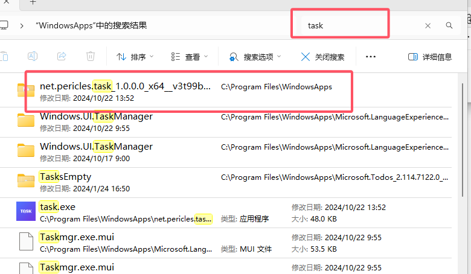
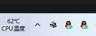

<h1>Dart 定时打印热敏票据</h1>

- [使用前准备](#使用前准备)
  - [后台设置](#后台设置)
  - [应用启动 打印服务](#应用启动-打印服务)
- [数据获取(队列表 mOperateType 数值与获取打印数据条件说明)](#数据获取队列表-moperatetype-数值与获取打印数据条件说明)
  - [弹柜（使用系统设置内的发票打印机）](#弹柜使用系统设置内的发票打印机)
  - [打印发票（使用系统设置内的发票打印机）](#打印发票使用系统设置内的发票打印机)
  - [打印二维码（使用系统设置内的上菜单打印机）](#打印二维码使用系统设置内的上菜单打印机)
  - [打印客户记录（使用系统设置内的发票打印机）](#打印客户记录使用系统设置内的发票打印机)
  - [打印厨房单（使用食品所属类目二对应的打印机）](#打印厨房单使用食品所属类目二对应的打印机)
  - [打印上菜单（使用系统设置内的上菜单打印机）](#打印上菜单使用系统设置内的上菜单打印机)
  - [打印外卖单(使用后台数据库,类目 1'Kiosk 形式'为'是'时才在外卖上显示)](#打印外卖单使用后台数据库类目-1kiosk-形式为是时才在外卖上显示)
  - [EFTPay 支付（待定）](#eftpay-支付待定)
  - [void 退单（待定）](#void-退单待定)
  - [食品銷售報表-日結報表](#食品銷售報表-日結報表)
- [安装](#安装)
  - [Android 平台](#android-平台)
    - [Android 安装包下载](#android-安装包下载)
    - [下载后无需多的设定，直接安装即可使用](#下载后无需多的设定直接安装即可使用)
  - [windows 桌面平台](#windows-桌面平台)
    - [使用安装包内的数据签名安装](#使用安装包内的数据签名安装)
      - [windows 安装包下载](#windows-安装包下载)
      - [安装说明](#安装说明)
      - [快速打开应用](#快速打开应用)
      - [创建桌面快捷方式](#创建桌面快捷方式)
      - [查看服务是否启动](#查看服务是否启动)
      - [解除安装](#解除安装)
    - [使用先安装证书后安装应用方式安装](#使用先安装证书后安装应用方式安装)
      - [证书下载 certificate.pfx](#证书下载-certificatepfx)
      - [证书安装说明](#证书安装说明)
- [开发环境](#开发环境)

# 使用前准备

## 后台设置

1. 后台类目二打印机必须设置 IP 地址，并且 IP 地址与电脑在同一网段。
2. 系统维护->系统设置->发票打印机、上菜单打印机、外卖单打印机设置为 IP 打印机，云打印设置为"N"。
3. 除了外卖发票与外卖厨房单使用后台数据库，pos2.0 所有单据均使用前台数据库(即后台数据库改动后，要使用后台系统维护内的"更新前台数据功能"来同步到前台数据库)。
4. 确保系统数据库中:
   - 公司数据表有mBackup_printing_time(后备打印(分钟)栏位)
   - 打印机表有mBackupPrinter(备用打印机栏位)
   - 此两个栏位都有值时，超过最大连接时间后，才会使用备用打印机打印。
5. 打印语言
   - 打印语言跟随登录的收银机
   - 后台系统设置内设置收银机语言(eg:英文、繁体、简体),设置英文打印效果为英文，设置繁体打印效果为繁体，设置简体打印效果为简体

## 应用启动 打印服务

1. 打开 pos2.0 大厅的设置按钮。
2. 选择"列印设置"
3. 点击"开始列印"按钮（启动右上角图标可查看与测试已经设置的 IP 打印机连接状况）
   - 启动条件：当前登录收银机必须和系统设置内的 airprint 一致(启动条件满足时进入大厅页自动启动打印服务,前提是没有手动在“列印设置”中点击“停止列印”按钮)
   - 终止打印：点击“停止打印”按钮或者退出 pos2.0 大厅

# 数据获取(队列表 mOperateType 数值与获取打印数据条件说明)

## 弹柜（使用系统设置内的发票打印机）

- 数据获取条件：
  - 队列表 mOperateType = 1
- 打印完成后：

  - 删除队列表 mOperateType = 1 的数据

## 打印发票（使用系统设置内的发票打印机）

- 数据获取条件：
  - 队列表 mOperateType = 2
  - 发票表 mPrintInvoice = 1
  - 发票明细表 mIsPrint 不等于 D (P:正常 PF:追单 PM:改单 PD:删单 PT:转台单)
- 打印完成后：
  - 发票表 mPrintInvoice 从 1 修改为 0
  - 删除队列表 mOperateType = 2 的数据

## 打印二维码（使用系统设置内的上菜单打印机）

- 数据获取条件：
  - 队列表 mOperateType = 3
  - 发票表 mPrintInvoice = 2 mBTemp=1
- 打印完成后：
  - 发票表 mPrintInvoice 从 2 修改为 0
  - 删除队列表 mOperateType = 3 的数据

## 打印客户记录（使用系统设置内的发票打印机）

- 数据获取条件：
  - 队列表 mOperateType = 4
  - 发票表 mPrintInvoice = 3
  - 发票明细表 mIsPrint 不等于 D (P:正常 PF:追单 PM:改单 PD:删单 PT:转台单)
- 打印完成后：
  - 发票表 mPrintInvoice 从 3 修改为 0
  - 删除队列表 mOperateType = 4 的数据

## 打印厨房单（使用食品所属类目二对应的打印机）

- 数据获取条件：
  - 队列表 mOperateType = 5
  - 发票明细表 mIsPrint 不等于 D (P:正常 PF:追单 PM:改单 PD:删单 PT:转台单)
- 打印完成后：
  - 发票明细表 mIsPrint PD 修改为 D 其它几种修改为 Y
  - 删除队列表 mOperateType = 5 的数据

## 打印上菜单（使用系统设置内的上菜单打印机）

- 数据获取条件：
  - 队列表 mOperateType = 6
  - 发票表 mPrintBDL = 1
  - 发票明细表 mIsPrint 不等于 D (P:正常 PF:追单 PM:改单 PD:删单 PT:转台单)
- 打印完成后：
  - 发票表 mPrintBDL 从 1 修改为 0
  - 删除队列表 mOperateType = 6 的数据

## 打印外卖单(使用后台数据库,类目 1'Kiosk 形式'为'是'时才在外卖上显示)

- 数据获取条件：
  - 队列表 mOperateType = 7
  - 后台外卖发票表 TA_print = Y
- 打印完成后：
  - 后台外卖发票表 TA_print = N
  - 删除队列表 mOperateType = 7 的数据
- 打印外卖厨房需要到 pos2.0 手机外卖处进行转单

## EFTPay 支付（待定）

## void 退单（待定）

## 食品銷售報表-日結報表

- 使用后台系统设置内的发发票 IP 打印机，重印发票跟队列（和结账时收据一样使用发票 IP 打印机）

# 安装

## Android 平台

### Android 安装包下载

[**Android task.apk 下载**](https://github.com/rosscarsen/Task/releases/download/1.0.3/Task250102.apk)

### 下载后无需多的设定，直接安装即可使用

## windows 桌面平台

<h5>已测试 win11、win10 系统,win7 不支持，可能是 Dart 从 22 年就不支持在 win7 上开发的缘故</h5>

### 使用安装包内的数据签名安装

#### windows 安装包下载

[**Windows task.msix 下载**](https://github.com/rosscarsen/Task/releases/download/1.0.3/task.msix)

#### 安装说明

- 安装包下载后(此时直接双击“安装”按钮是灰色不可点击)，右键“task.msix”，选择“属性”。
- 切换到“数字签名”，选择详细
  
- 常规选项卡，点击“查看证书”。
  
- 常规选项卡安装证书，点击“安装证书”。
  
- 选择本地计算机，点击“下一步”。
  
- 选择“将所有证书放入以下存储”，点击“浏览”。
  
- "弹出导入成功"后，对所有弹出框点击“确定”。

#### 快速打开应用

使用 <kbd>Win</kbd>+<kbd>X</kbd>弹出后按键盘<kbd>A</kbd>打开 power shell，输入'task'回车打开  


#### 创建桌面快捷方式

- task.msix 是以系统应用方式安装的，所以没有桌面快捷方式，可以手动创建一个，步骤如下：
  - 安装路径：C:\Program Files\WindowsApps
  - WindowsApps 进入都会提示没有权限，不让打开，此时需要以管理员身份运行，右键“WindowsApps”选择“属性”，切换到“安全”选项卡，点击“高级”
    
  - 所有者后边“更改”按钮
    
  - 选择"高级"
    
  - "立即查找"，点选"administrators"
    
  - 点击“确定”关闭所有弹出框,此时就可以进入 WindowsApps 目录了
  - 进入后输入“task”搜索，点开红框，打开后请勿删除里边任何内容  
    
  - 右键“task”选择“发送到”->“桌面快捷方式”  
    

#### 查看服务是否启动

- 任务柆托盘内是否有打印图标（鼠标放上去显示“Take Airprint Running”），有图标表示服务启动，没有则表示服务未启动  
  
- 如果在隐藏的状态，可按住拖动到隐藏图标<kbd>^</kbd>的右边，以方便以后查看打印服务启动状态  
  
- 服务一旦启动，windows 系统将不会进入休眠状态与黑屏，手动让系统进入睡眠状态，打印服务也不会终止

#### 解除安装

- <kbd>Win</kbd>+<kbd>X</kbd>弹出后按<kbd>N</kbd>
- 应用->安装的应用
  

### 使用先安装证书后安装应用方式安装

#### 证书下载 certificate.pfx

[**Windows certificate.pfx 下载**](https://github.com/rosscarsen/Task/releases/download/1.0.3/certificate.pfx)

#### 证书安装说明

- 双击证书
- 本地计算机
- 输入密码 123456
- 勾选“标记此密钥可导出的密钥（M）”
- 勾选“将所有证书放入以下存储”
- 选择"受信任的根证书颁发机构"
- 双击下载好的 task.msix

# 开发环境

```yaml
#字符串处理
characters: ^1.3.0
#数据处理
collection: ^1.18.0
cupertino_icons: ^1.0.8
#设备信息
device_info_plus: ^11.1.0
#网络请求
dio: ^5.7.0
#escpos工具
flutter_esc_pos_utils: ^1.0.1
#escpos连接
flutter_esc_pos_network: ^1.0.3
flutter:
  sdk: flutter
#移动端后台服务
flutter_background_service: ^5.0.10
#Android后台服务
flutter_background_service_android: ^6.2.7
#对话提示工具
flutter_easyloading: ^3.0.5
#webview
flutter_inappwebview: ^6.1.5
#本地化
flutter_localizations:
  sdk: flutter
#状态管理
get: ^4.6.6
#本地存储
get_storage: ^2.1.1
#图片处理
image: ^4.3.0
#国际化
intl: ^0.19.0
#日志
logger: ^2.4.0
#路径
path_provider: ^2.1.4
#二维码
qr_flutter: ^4.1.0
#托盘
tray_manager: ^0.2.4
#windows
win32: ^5.6.0
#交错动画
flutter_staggered_animations: ^1.1.1
#应用图标
flutter_launcher_icons: ^0.14.1
#启动图
flutter_native_splash: ^2.4.1
```
